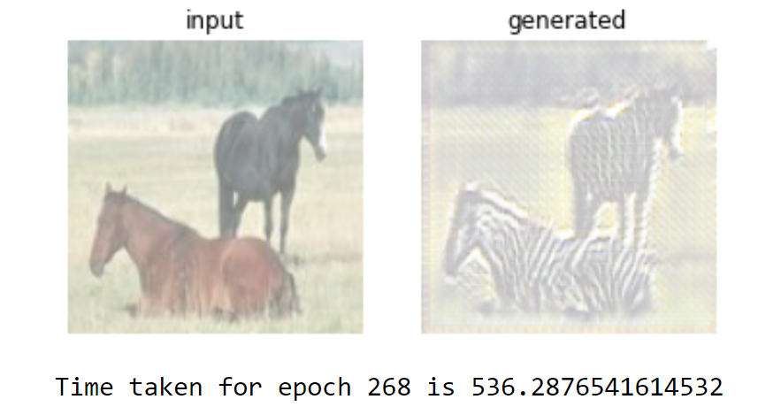
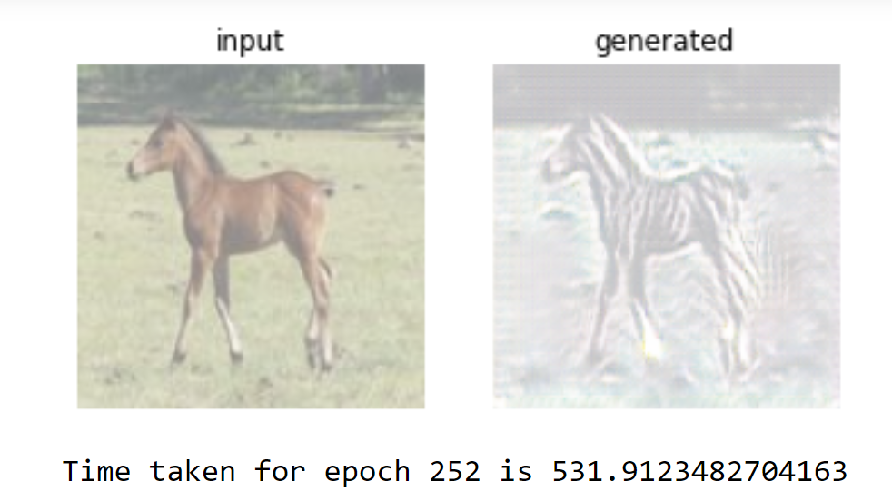
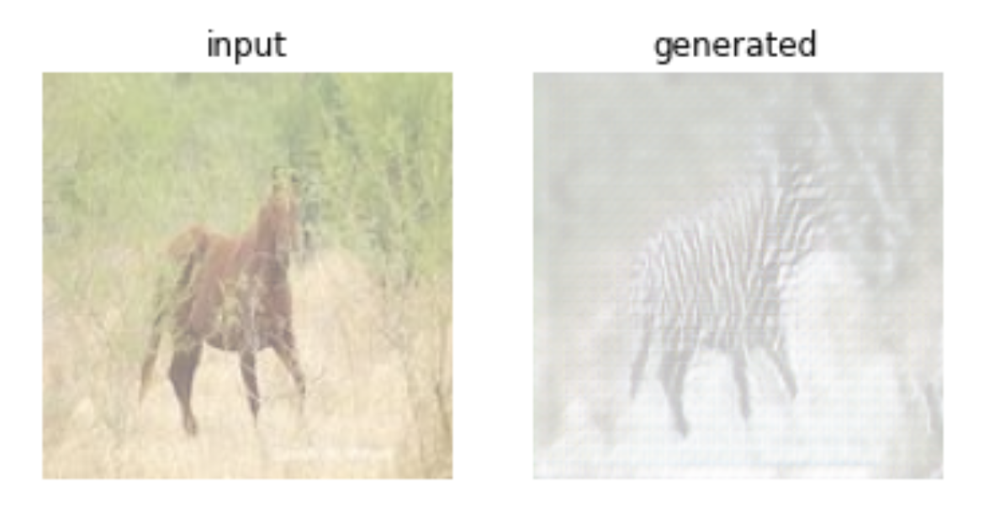
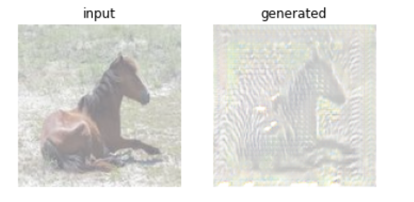
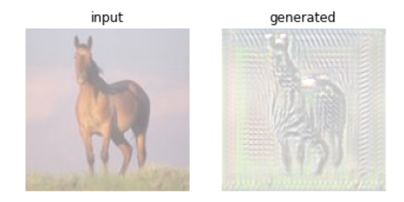
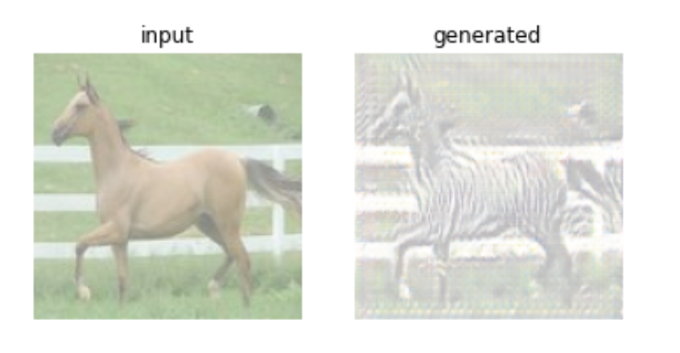

# CS401-CYCLE-GAN-project
A Cyclic generative adversarial network which transforms the images of horses into zebras.

# Introduction:
This project is an example of how powerful the Generative networks are when they come in terms with discriminative networks.

# Results:
### Examples

