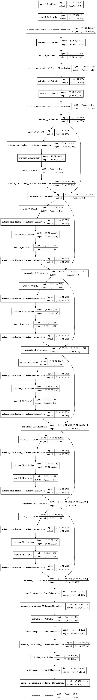
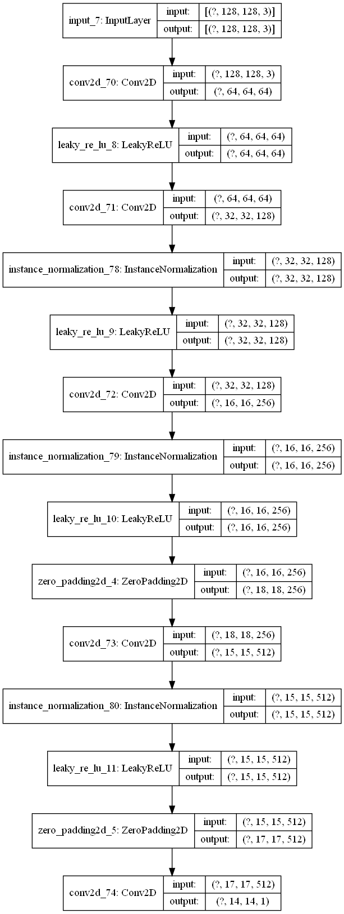

# CS401-CYCLE-GAN-project
A Cyclic generative adversarial network which transforms the images of horses into zebras.

# Introduction:
This project is an example of how powerful the Generative networks are when they come in terms with the discriminative networks.

[How does it work?](https://www.tensorflow.org/tutorials/generative/cyclegan)

## Models:
[Model used:](https://github.com/Astrojigs/cs401-CYCLE-GAN-project/blob/main/models.py)

## Losses:
[Losses used:](https://github.com/Astrojigs/cs401-CYCLE-GAN-project/blob/main/losses.py)

### Generator model:

### Discriminator model:

# Results:
### Examples

